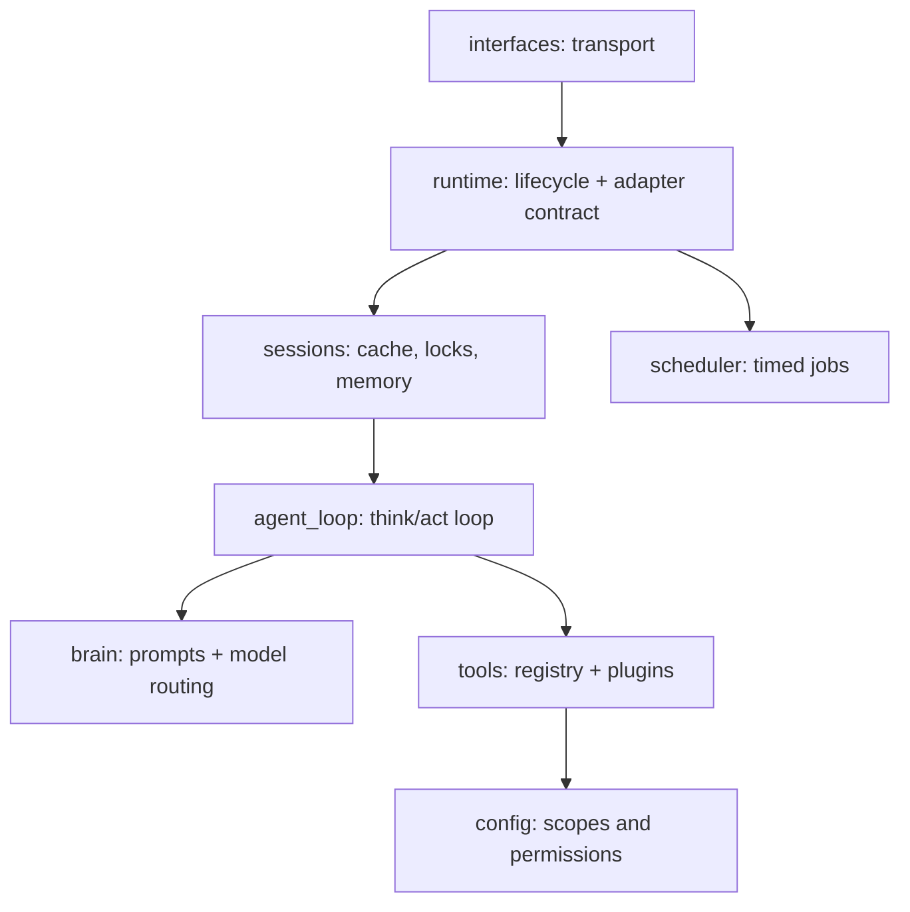

# Paw Agent

## Why Paw?

It's an AI assistant you can reach from your phone, terminal, or browser, running tools you wrote yourself, with memory across conversations. The whole runtime is under 2,000 lines of Python so it stays lightweight and readable end to end. Feel free to contribute if you share the same interest.

## Features

A personal agent runtime with:

- LiteLLM-backed model routing
- native tool calling from Python tools in `paw/tools/`
- scoped file read/write/search (`read_file`, `list_dir`, `grep_files`, `find_files`, `write_file`, `edit_file`, `delete_file`)
- Discord, WeChat (iLink ClawBot), CLI, scheduler, and per-session memory

The durable knowledge layer lives outside this repo. The default profile is:

```text
~/my-kb/INDEX.md
```

That index contains the shared agent soul and routes to the relevant sub-KB.

## Setup

1.  **Create a virtual environment** (recommended to avoid system package conflicts):
    ```bash
    python3 -m venv venv
    source venv/bin/activate  # On Windows: venv\Scripts\activate
    ```

2.  **Install dependencies**:
    ```bash
    pip install -r requirements.txt
    ```

3.  **Set up environment variables**:
    ```bash
    cp .env.example .env
    # edit .env and fill in your API keys
    ```
    At minimum, set one LLM key (`GEMINI_API_KEY`, `DEEPSEEK_API_KEY`, etc.) and
    `DISCORD_TOKEN` if you want the Discord interface.

4.  **Configure runtime**:
    ```bash
    cp config.example.json config.json
    # edit config.json:
    #   - set shared_soul / agent_profile to your KB paths (see below)
    #   - enable/disable interfaces
    #   - adjust model_strategy to match your API keys
    #   - tune reasoning_effort per agent (see below)
    ```

### Reasoning Effort

`reasoning_effort` is an optional cross-model knob (`"minimal"` / `"low"` /
`"medium"` / `"high"`). LiteLLM translates it into each provider's native
thinking/reasoning controls, so one setting spans the whole `model_strategy`
fallback chain — and LiteLLM silently drops it for models that don't support
reasoning.

Set it per agent when you want to override the model's behavior:

```jsonc
"agents": {
    "applied-scientist": { "reasoning_effort": "high" }
}
```

When an agent leaves it unset (the default), Paw sends no reasoning parameter
and each provider applies its own default thinking behavior.

## Usage

Ensure your virtual environment is activated before running these commands.

### Default Runtime

Starts the interfaces enabled in `config.json`:

```bash
python -m paw --debug
```

### CLI Only

```bash
python -m paw --debug --interface cli
```

### Discord Only

```bash
python -m paw --debug --interface discord
```

If your network requires an HTTP(S) proxy for Discord:

```bash
HTTPS_PROXY=http://host:port HTTP_PROXY=http://host:port python -m paw --debug
```

### WeChat (iLink ClawBot)

Paw connects to WeChat via Tencent's official iLink Bot API — no public IP or
webhook required. All connections are outbound long-poll to `ilinkai.weixin.qq.com`.

**Prerequisites**: iOS WeChat 8.0.70+ or latest Android. Enable the ClawBot plugin:
WeChat → Me → Settings → Plugins → ClawBot.

**First run** (one-time login):

```bash
python -m paw --interface wechat
```

A browser window opens with a QR code. Scan it in WeChat → ClawBot plugin → confirm.
Credentials are saved to `paw/interfaces/wechat_creds.json` (git-ignored).
Subsequent starts reuse the saved token automatically; if the token expires paw
re-opens the browser for a fresh scan.

**Enable in config.json**:

```json
"interfaces": {
    "wechat": { "enabled": true }
}
```

**Privacy note**: all messages pass through Tencent's servers (`ilinkai.weixin.qq.com`),
the same data path as WeChat itself. The bot token is stored locally and never committed.

**Limitation**: WeChat ClawBot is a personal AI assistant channel — only the account
owner can send messages to the bot. It cannot be added as a contact by other users.

## Knowledge Base (KB) Quickstart

Paw reads its agent personality and domain knowledge from plain Markdown files
outside this repo — your **Knowledge Base (KB)**. This keeps your personal
instructions and context separate from the runtime code.

Minimal setup:

```
~/my-kb/
  SOUL.md           # shared values, tone, always-on instructions
  generalist/
    INDEX.md        # agent profile: role, skills, delegation rules
```

Point `config.json` at these files:

```json
"shared_soul": "~/my-kb/SOUL.md",
"agent_profile": "~/my-kb/generalist/INDEX.md"
```

The agent will have access to read and list files under the `kb` scope roots you
configure. Add as many sub-folders, SOPs, or reference files as you like — the
agent loads them on demand via `read_file` / `list_dir`.

## Agent Profile and File Access

`config.json` points each Paw instance at one active agent profile:

```json
"shared_soul": "~/my-kb/SOUL.md",
"agent_profile": "~/my-kb/generalist/INDEX.md",
"file_access": {
    "default_scope": "kb",
    "scopes": {
        "kb": {
            "roots": ["~/my-kb"],
            "read": true,
            "list": true,
            "write": "ask",
            "append": "ask",
            "edit": "ask",
            "delete": "ask"
        }
    }
}
```

Each scope has per-operation permission fields: `read`, `list`, `write`, `append`,
`edit`, `delete`. Each takes one of three values: `true` (always allow), `false`
(always block), or `"ask"` (require human approval through the runtime's reply
channel; blocked when no channel is available). Roots and permissions are owned by
config; the model can never expand them.

`runtime.md` contains host-side include markers:

```text
{{ include:SHARED_SOUL }}
{{ include:AGENT_PROFILE }}
```

`PromptAssembler` replaces those markers with text from `shared_soul` and
`agent_profile` before sending the system prompt to the model. The model sees
only the resolved text, not the markers or source paths. Keep both files
concise because they are always-on prompt content.

### Relative KB paths

Always-on prompt resources (shared soul + agent profile) are wrapped with a
small header that includes a **logical path** and **base path** (relative to
the `kb` scope root). This lets the model resolve references like
`sops/foo.md` relative to the currently loaded profile without relying on
absolute filesystem paths.

For on-demand reads, `read_file` and `list_dir` accept an optional
`base_path` argument. When `path` is relative and `base_path` is provided, the
runtime resolves `path` relative to the directory containing `base_path`
(still confined to the configured scope roots).

The model selects a scope by name when calling the file tools (`read_file`,
`list_dir`, `grep_files`, `find_files`, `write_file`, `edit_file`,
`delete_file`) for task-specific KB files, SOPs, templates, exact source text,
or to record durable notes/memories. Roots and permissions are owned by config;
the model cannot expand them.

Runtime tool schemas are the source of truth for directly callable Paw tools.
KB skills may mention CLIs, APIs, MCP tools, or external services; those are
execution surfaces, not guaranteed runtime tools. Use them only when the current
runtime exposes the tool or the command/service is available in the environment.

Temporary overrides:

```bash
PAW_SHARED_SOUL=~/my-kb/SOUL.md \
PAW_AGENT_PROFILE=~/my-kb/generalist/INDEX.md \
PAW_KNOWLEDGE_ROOTS=~/my-kb \
python -m paw --debug
```

`PAW_KNOWLEDGE_ROOTS` uses the OS path separator (`:` on macOS/Linux) and
maps into the `kb` scope.

## Context & Memory Design

**One vocabulary, one log.** Everything — the live prompt and the durable
history — speaks provider-ready chat messages (`system` / `user` / `assistant`
/ `tool`). The session log stores exactly what is replayed to the model: the
log *is* the prompt history. No translation layers.

### Every model call is four sections, in order

```text
1. system            — soul, indexes, tool catalog          (static)
2. history           — distant (Q&A-condensed), then        (from the log)
                       recent exchanges, folded compact
3. current exchange  — this exchange, live, full fidelity   (in memory)
4. context           — time + session note + rolling        (volatile, last)
                       summary, very short
```

Sections 1–3 form a stable, append-only prefix: within an exchange only
section 3 grows, across exchanges only section 2 grows, and the volatile block
stays last — so provider prefix caching makes re-sending the growing context
cheap. (Built by `PromptAssembler.build_prompt` in `paw/agent_loop/`.)

### Within an exchange: append at full fidelity

An **exchange** is one user input through one final answer; it can span many
tool rounds. Each step is appended as-is to the current-exchange section: your
message, the AI's tool calls, complete tool results, the AI's next step. The
model always works with exact content — a file read this turn is present
verbatim while the turn lasts. Two guards keep a turn bounded: a tool-round cap
and a context-window overflow stop, both of which ask the model to answer with
what it has.

### At step-out: fold once

When the exchange finishes, `AgentLoop._fold_exchange` compacts it into a few
chat messages and appends them to the log via `Memory.add_exchange`:

- the user message, kept verbatim;
- per tool round, a skeleton assistant anchor (real tool names, synthetic ids,
  empty args — just enough to keep every tool message legally paired) followed
  by one compacted tool message per result;
- the final assistant answer, kept verbatim.

### Tool compaction is uniform

Tools are plain Python functions; they know nothing about history. The
registry renders every call + result the same way
(`ToolRegistry.compact_interaction`):

```text
tool call: read_file(path='INDEX.md')          # arg values capped at 100 chars
tool result: <first 500 chars>… [2300 chars total]
```

If exact text from a file is needed again in a later exchange, the model calls
`read_file` again — files themselves are the durable memory.

### History replays in two resolutions: distant + recent

Recent history is a plain slice of the log, budgeted by tokens (default 10K;
the system prompt is not counted). Cuts land only on exchange boundaries,
keeping anchor/tool pairs intact.

Older exchanges don't vanish — they move into the **distant** section,
compacted to just the user text and the final assistant text (tool anchors and
results drop together, so every pair stays a legal message sequence). An
exchange rolls recent → distant when either trigger fires
(`Memory.roll_distant`, called at exchange start):

- **Silence gap ≥ 2h** — a long break ends the conversation: *everything*
  rolls to distant, and a `SESSION NOTE` in the volatile block tells the model
  to treat the new message as a fresh conversation. This is what keeps a
  forever-session chat (WeChat) from replaying yesterday's thread as if it
  were mid-flight.
- **Token budget overflow** — the oldest exchanges roll in groups of 3, always
  keeping at least one, so the recent window start holds steady across turns
  and the cached prefix survives.

Distant is itself capped at 2K chars of content; when exceeded, the oldest
whole Q&A pairs drop down to 1K — trimming past the cap in one step keeps the
section byte-stable across many exchanges, for the same prefix-caching reason.

Why the cache math works out: the gap roll rewrites the prompt near its start,
but after 2h of silence the provider cache is cold anyway, so that
invalidation is free. The budget roll moves distant's young edge and recent's
old edge in the same event — one cache invalidation, not two.

### Continuity rides on a rolling summary

The model ends each reply with a 2-sentence `Context:` line capturing goal and
state. It is persisted as `context_summary` and shown in the volatile block on
every call — cheap, always current, and independent of the history window.

### Worked example

One complete model call. Two exchanges are already in the log; the current
exchange is mid-flight (the model already read a file, this call decides what
to do next):

```python
messages = [
  # ── 1. system (static, cached) ────────────────────────────────
  {"role": "system", "content": "<soul + indexes + tool catalog>"},

  # ── 2. history, distant: yesterday's chat, rolled after a >2h
  #      gap — condensed to bare Q&A pairs, tool traffic gone ────
  {"role": "user", "content": "帮我查一下明天的天气"},
  {"role": "assistant", "content": "明天晴，30度。"},

  # ── 2. history, recent: exchange 1, folded at step-out ────────
  {"role": "user", "content": "What's in my notes folder?"},
  {"role": "assistant", "tool_calls": [          # skeleton anchor
      {"id": "h1", "type": "function",
       "function": {"name": "list_dir", "arguments": "{}"}}]},
  {"role": "tool", "tool_call_id": "h1", "content":
      "tool call: list_dir(path='notes')\n"
      "tool result: ideas.md\npaw.md\nkb-paper.md [34 chars total]"},
  {"role": "assistant", "content": "You have three notes: ideas, paw, kb-paper."},

  # ── 2. history, recent: exchange 2, no tools → a plain pair ───
  {"role": "user", "content": "Remind me what paw is?"},
  {"role": "assistant", "content": "Paw is your personal agent harness project."},

  # ── 3. current exchange (live, full fidelity) ─────────────────
  {"role": "user", "content": "Summarize kb-paper.md for me."},
  {"role": "assistant", "tool_calls": [          # real call, real args
      {"id": "call_a7x", "type": "function",
       "function": {"name": "read_file",
                    "arguments": '{"path": "notes/kb-paper.md"}'}}]},
  {"role": "tool", "tool_call_id": "call_a7x",
   "content": "# KB vs RAG\n<...the ENTIRE 2300-char file, verbatim...>"},

  # ── 4. volatile context (rebuilt every call, always last) ─────
  {"role": "user", "content":
      "Now: 2026-07-17 09:10 EDT (13:10 UTC)\n\n"
      "CONTEXT SUMMARY:\nUser is reviewing their notes; paw project discussed."},
]
```

When this exchange finishes (say the model answers "It argues KB beats RAG for
personal agents."), section 3 is folded once and appended to the log — full
file content compacted, real ids replaced by synthetic ones:

```python
{"role": "user", "content": "Summarize kb-paper.md for me."},
{"role": "assistant", "tool_calls": [
    {"id": "h1", "type": "function",
     "function": {"name": "read_file", "arguments": "{}"}}]},
{"role": "tool", "tool_call_id": "h1", "content":
    "tool call: read_file(path='notes/kb-paper.md')\n"
    "tool result: # KB vs RAG\n<first 500 chars>… [2300 chars total]"},
{"role": "assistant", "content": "It argues KB beats RAG for personal agents."},
```

On the next exchange these four messages appear in section 2, and section 3
starts fresh with the new user input.

## Component Catalog

The repo is organized as one folder per component, each with a small, clear
API. Components import only downward in the dependency graph below.



| Component | Folder | Main API | Input | Output | Owns |
| --- | --- | --- | --- | --- | --- |
| Runtime | `paw/runtime/` | `PawApp.start()`, `stop()`, `handle_user_message()` | Config, enabled interfaces, normalized user messages | Started services, final replies | Process lifecycle, component wiring, and the `PawInterface`/`UserMessage`/`ReplyTarget` adapter contract (`paw/runtime/adapter.py`) that every interface implements |
| Interfaces | `paw/interfaces/` | `Interface.start()`, `stop()`, `ReplyTarget.send()` | Discord / CLI events | `UserMessage` objects and outbound replies | Transport-specific translation only |
| Sessions | `paw/sessions/` | `SessionManager.process(session_id, text, metadata)`, `archive()`, `shutdown()` | Session ID, text, metadata | Final response string, persisted session state | Per-session locking, cache, memory persistence |
| Agent Loop | `paw/agent_loop/` | `AgentLoop.process_input(text, metadata)` | User turn plus session memory | Final assistant text | Think/act loop: brain call, tool execution, memory updates |
| Brain | `paw/brain/` | `Brain.decide(...)` | Provider-ready chat messages, tool schemas | Normalized model decision, usage, errors | LiteLLM routing, retry/fallback, model output parsing |
| Tools | `paw/tools/` | `ToolRegistry.get_tool_definitions()`, `ToolRegistry.execute(...)`, file plugins like `read_file` / `write_file` / `edit_file` | Tool schemas and tool calls | Tool results | Tool discovery, schema generation, execution, scoped file access |
| Scheduler | `paw/scheduler/` | `SchedulerService.start()`, `run_tick()` | Job store, current time | Scheduled agent runs and delivery requests | Timed jobs and recurrence |
| Config | `paw/config/` | `load_raw_config()`, `load_paw_config()` | `config.json`, env overrides | `PawConfig`, `FileAccessConfig`, `FileScope` | Configuration parsing and file scope policy |
| Prompt Assembly | `paw/agent_loop/` (`prompt_assembler.py`, `agent.md`) | `PromptAssembler.build_prompt(...)` | History + current exchange + volatile context | Four-section message list | Prompt structure and harness-level instructions |

`paw/wire_types.py` is deliberately not a component in this table: it's a single
leaf file (no folder, no behavior) holding the tool-calling dataclasses
(`ToolCall`, `ToolResult`, `ToolDefinition`, `BrainDecision`) that Brain, Tools,
and Agent Loop exchange without depending on each other. It stays a flat file
rather than a folder specifically so it can't be mistaken for a component.

External knowledge is not an Paw component. The KB lives wherever you point
`file_access.scopes.kb.roots` in `config.json` and is exposed to Paw through the `kb` file scope.

### Runtime state

- `paw/sessions/_data/` — per-session JSON history (git-ignored)
- `paw/scheduler/jobs.json` — scheduled jobs (git-ignored)
- `paw/interfaces/discord_session_mapping.json` — Discord channel mappings (git-ignored)
- `paw/interfaces/wechat_creds.json` — WeChat bot token (git-ignored)
- `paw/interfaces/wechat_state.json` — WeChat message cursor (git-ignored)

### Test Boundaries

- `tests/brain/` — Brain, providers, prompt assembler (LiteLLM mocked)
- `tests/tools/` — ToolRegistry, file tools, scoped file access helper
- `tests/config/` — config loading + env overrides
- Future suites: `tests/runtime/`, `tests/interfaces/`, `tests/sessions/`, `tests/agent_loop/`, `tests/scheduler/`

Each test mocks only the boundary directly below the component under test.
