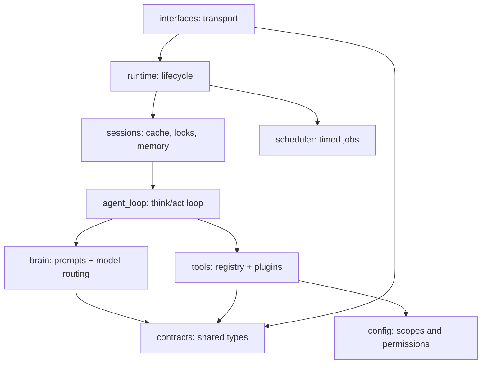

# Swarm Agent

## Why Swarm?

It's an AI assistant you can reach from your phone, terminal, or browser, running tools you wrote yourself, with memory across conversations. The whole runtime is under 2,000 lines of Python so it stays lightweight and readable end to end. Feel free to contribute if you share the same interest.

## Features

A personal agent runtime with:

- LiteLLM-backed model routing
- native tool calling from Python tools in `swarm_agent/tools/`
- scoped file access via `read_file` / `list_dir`
- Discord, CLI, scheduler, and per-session memory

The durable knowledge layer lives outside this repo. The default profile is:

```text
~/my-kb/INDEX.md
```

That index contains the shared agent soul and routes to the relevant sub-KB.

## Setup

1.  **Create a virtual environment** (recommended to avoid system package conflicts):
    ```bash
    python3 -m venv venv
    source venv/bin/activate  # On Windows: venv\Scripts\activate
    ```

2.  **Install dependencies**:
    ```bash
    pip install -r requirements.txt
    ```

3.  **Set up environment variables**:
    ```bash
    cp .env.example .env
    # edit .env and fill in your API keys
    ```
    At minimum, set one LLM key (`GEMINI_API_KEY`, `DEEPSEEK_API_KEY`, etc.) and
    `DISCORD_TOKEN` if you want the Discord interface.

4.  **Configure runtime**:
    ```bash
    cp config.example.json config.json
    # edit config.json:
    #   - set shared_soul / agent_profile to your KB paths (see below)
    #   - enable/disable interfaces
    #   - adjust model_strategy to match your API keys
    ```

## Usage

Ensure your virtual environment is activated before running these commands.

### Default Runtime

Starts the interfaces enabled in `config.json`:

```bash
python -m swarm_agent --debug
```

### CLI Only

```bash
python -m swarm_agent --debug --interface cli
```

### Discord Only

```bash
python -m swarm_agent --debug --interface discord
```

If your network requires an HTTP(S) proxy for Discord:

```bash
HTTPS_PROXY=http://host:port HTTP_PROXY=http://host:port python -m swarm_agent --debug
```

## Knowledge Base (KB) Quickstart

Swarm reads its agent personality and domain knowledge from plain Markdown files
outside this repo — your **Knowledge Base (KB)**. This keeps your personal
instructions and context separate from the runtime code.

Minimal setup:

```
~/my-kb/
  SOUL.md           # shared values, tone, always-on instructions
  generalist/
    INDEX.md        # agent profile: role, skills, delegation rules
```

Point `config.json` at these files:

```json
"shared_soul": "~/my-kb/SOUL.md",
"agent_profile": "~/my-kb/generalist/INDEX.md"
```

The agent will have access to read and list files under the `kb` scope roots you
configure. Add as many sub-folders, SOPs, or reference files as you like — the
agent loads them on demand via `read_file` / `list_dir`.

## Agent Profile and File Access

`config.json` points each Swarm instance at one active agent profile:

```json
"shared_soul": "~/my-kb/SOUL.md",
"agent_profile": "~/my-kb/generalist/INDEX.md",
"file_access": {
    "default_scope": "kb",
    "scopes": {
        "kb": {
            "roots": ["~/my-kb"],
            "read": true,
            "list": true
        }
    }
}
```

`runtime.md` contains host-side include markers:

```text
{{ include:SHARED_SOUL }}
{{ include:AGENT_PROFILE }}
```

`PromptAssembler` replaces those markers with text from `shared_soul` and
`agent_profile` before sending the system prompt to the model. The model sees
only the resolved text, not the markers or source paths. Keep both files
concise because they are always-on prompt content.

### Relative KB paths

Always-on prompt resources (shared soul + agent profile) are wrapped with a
small header that includes a **logical path** and **base path** (relative to
the `kb` scope root). This lets the model resolve references like
`sops/foo.md` relative to the currently loaded profile without relying on
absolute filesystem paths.

For on-demand reads, `read_file` and `list_dir` accept an optional
`base_path` argument. When `path` is relative and `base_path` is provided, the
runtime resolves `path` relative to the directory containing `base_path`
(still confined to the configured scope roots).

The model selects a scope by name when calling `read_file(path, scope=...)`
or `list_dir(path, scope=...)` for additional task-specific KB files, SOPs,
templates, or exact source text. Roots and permissions are owned by config; the
model cannot expand them.

Runtime tool schemas are the source of truth for directly callable Swarm tools.
KB skills may mention CLIs, APIs, MCP tools, or external services; those are
execution surfaces, not guaranteed runtime tools. Use them only when the current
runtime exposes the tool or the command/service is available in the environment.

Temporary overrides:

```bash
SWARM_SHARED_SOUL=~/my-kb/SOUL.md \
SWARM_AGENT_PROFILE=~/my-kb/generalist/INDEX.md \
SWARM_KNOWLEDGE_ROOTS=~/my-kb \
python -m swarm_agent --debug
```

`SWARM_KNOWLEDGE_ROOTS` uses the OS path separator (`:` on macOS/Linux) and
maps into the `kb` scope.

## Session Memory Model

Swarm separates memory into four horizons. Keep these distinct when changing
the loop, tools, or prompt assembly.

### 1. Audit Log

The session JSON stores an append-only record of important runtime events:
user input, assistant decisions, compact tool results, token usage metadata,
and final context summary state. This is for debugging, replay, accounting,
and inspection. It is **not** copied wholesale into the next model prompt.

Large retention policy is intentionally separate from prompt behavior. A later
pruning/archival pass can cap active session files or move older events into
compressed archives without changing what the model sees.

### 2. Prompt History

The prompt receives only the recent visible conversation:

```text
RECENT CONVERSATION:
USER: ...
AI: ...
```

Internal tool calls, tool results, model retry errors, and system feedback are
not regular conversation and should not appear here. Failed model calls that do
not produce a valid decision should remain audit/debug events only.

### 3. Context Summary

`context_summary` is the durable compressed state of the session. It should
capture stable facts the model needs beyond the recent conversation window:
the user's goal, important preferences, decisions already made, current task
state, unresolved TODOs, and relevant constraints.

It should not contain full tool outputs, token usage, transient retry noise, or
copies of files that already live on disk. If the model does not provide a new
summary for a turn, the previous summary remains in place.

### 4. Working Trace

The working trace is short-lived state for the current user turn and tool loop.
It can include full current-turn tool results so a model can continue correctly
after a tool call, including the case where one provider fails and another
provider takes over mid-turn.

The working trace is passed to the model only while resolving that turn. Once
the assistant produces the final response, it is discarded; only compact audit
records remain in session history.

### File Read Persistence Rule

Files are already durable memory. When the agent reads a file through
`read_file`, the full contents may be returned to the model in the current
working trace, but session history stores only a compact reference:

```json
{
  "name": "read_file",
  "params": {"path": "INDEX.md", "scope": "kb"},
  "content_chars": 1234,
  "result_ref": {"type": "file", "scope": "kb", "path": "INDEX.md"}
}
```

Do not copy soul, profile, SOP, or other KB file bodies into long-term session
memory. The configured `shared_soul` and `agent_profile` are injected by
resolving the include markers in `runtime.md`; future turns should refer to
loaded paths and the context summary for other KB resources. If exact text from
an on-demand file is needed again, the model should call `read_file` again.

## Component Catalog

The repo is organized as one folder per component, each with a small, clear
API. Components import only downward in the dependency graph below.



| Component | Folder | Main API | Input | Output | Owns |
| --- | --- | --- | --- | --- | --- |
| Runtime | `swarm_agent/runtime/` | `SwarmApp.start()`, `stop()`, `handle_user_message()` | Config, enabled interfaces, normalized user messages | Started services, final replies | Process lifecycle and component wiring |
| Interfaces | `swarm_agent/interfaces/` | `Interface.start()`, `stop()`, `ReplyTarget.send()` | Discord / CLI events | `UserMessage` objects and outbound replies | Transport-specific translation only |
| Sessions | `swarm_agent/sessions/` | `SessionManager.process(session_id, text, metadata)`, `archive()`, `shutdown()` | Session ID, text, metadata | Final response string, persisted session state | Per-session locking, cache, memory persistence |
| Agent Loop | `swarm_agent/agent_loop/` | `AgentLoop.process_input(text, metadata)` | User turn plus session memory | Final assistant text | Think/act loop: brain call, tool execution, memory updates |
| Brain | `swarm_agent/brain/` | `Brain.decide(...)`, `Brain.submit_tool_results(...)` | Context, instruction, tool schemas | Normalized model decision, usage, errors | Prompt assembly, LiteLLM routing, retry/fallback, model output parsing |
| Tools | `swarm_agent/tools/` | `ToolRegistry.get_tool_definitions()`, `ToolRegistry.execute(...)`, plugins like `read_file` / `list_dir` | Tool schemas and tool calls | Tool results | Tool discovery, schema generation, execution, scoped file access |
| Scheduler | `swarm_agent/scheduler/` | `SchedulerService.start()`, `run_tick()` | Job store, current time | Scheduled agent runs and delivery requests | Timed jobs and recurrence |
| Config | `swarm_agent/config/` | `load_raw_config()`, `load_swarm_config()` | `config.json`, env overrides | `SwarmConfig`, `FileAccessConfig`, `FileScope` | Configuration parsing and file scope policy |
| Contracts | `swarm_agent/contracts/` | Shared dataclasses and protocols | Internal only | Internal only | Cross-component types (`ToolCall`, `BrainDecision`, `UserMessage`, etc.) |
| Prompts | `swarm_agent/prompts/` | Read by `PromptAssembler` | Runtime prompt file | System prompt fragment | Harness-level instructions only |

External knowledge is not a Swarm component. The KB lives wherever you point
`file_access.scopes.kb.roots` in `config.json` and is exposed to Swarm through the `kb` file scope.

### Runtime state

- `swarm_agent/sessions/_data/` — per-session JSON history (git-ignored)
- `swarm_agent/scheduler/jobs.json` — scheduled jobs (git-ignored)
- `swarm_agent/interfaces/discord_session_mapping.json` — Discord channel mappings (git-ignored)

### Test Boundaries

- `tests/brain/` — Brain, providers, prompt assembler (LiteLLM mocked)
- `tests/tools/` — ToolRegistry, file tools, scoped file access helper
- `tests/config/` — config loading + env overrides
- Future suites: `tests/runtime/`, `tests/interfaces/`, `tests/sessions/`, `tests/agent_loop/`, `tests/scheduler/`

Each test mocks only the boundary directly below the component under test.
