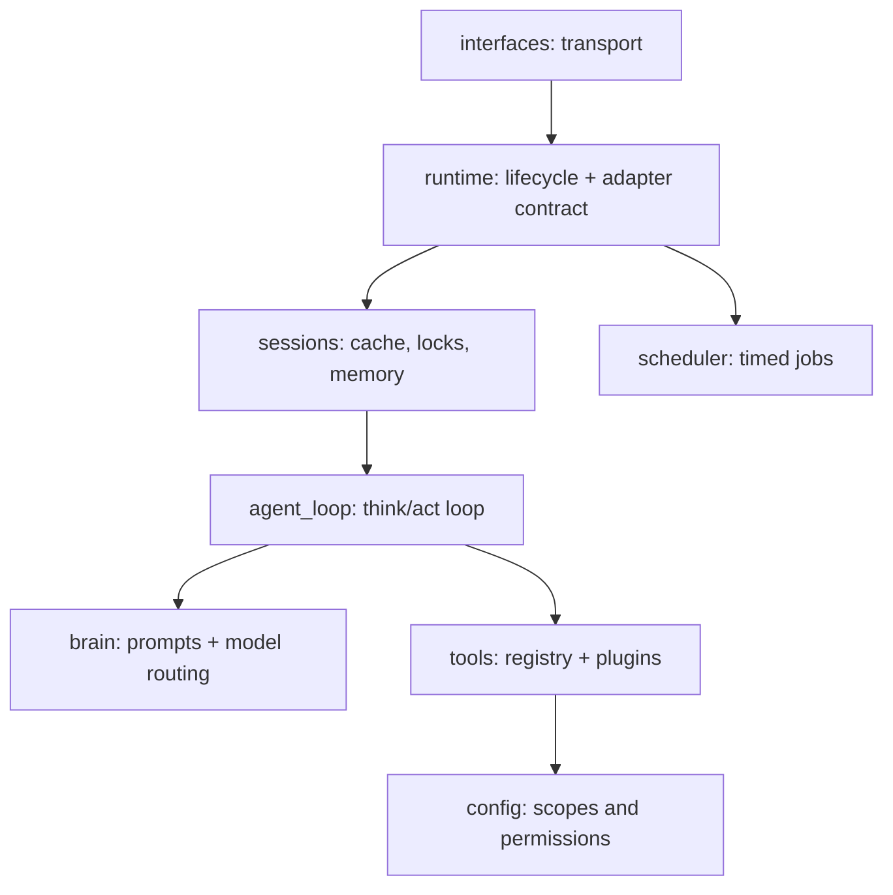

# Paw Agent

## Why Paw?

It's an AI assistant you can reach from your phone, terminal, or browser, running tools you wrote yourself, with memory across conversations. The whole runtime is under 2,000 lines of Python so it stays lightweight and readable end to end. Feel free to contribute if you share the same interest.

## Features

A personal agent runtime with:

- LiteLLM-backed model routing
- native tool calling from Python tools in `paw/tools/`
- scoped file read/write/search (`read_file`, `list_dir`, `grep_files`, `find_files`, `write_file`, `edit_file`, `delete_file`)
- Discord, WeChat (iLink ClawBot), CLI, scheduler, and per-session memory

The durable knowledge layer lives outside this repo. The default profile is:

```text
~/my-kb/INDEX.md
```

That index contains the shared agent soul and routes to the relevant sub-KB.

## Setup

1.  **Create a virtual environment** (recommended to avoid system package conflicts):
    ```bash
    python3 -m venv venv
    source venv/bin/activate  # On Windows: venv\Scripts\activate
    ```

2.  **Install dependencies**:
    ```bash
    pip install -r requirements.txt
    ```

3.  **Set up environment variables**:
    ```bash
    cp .env.example .env
    # edit .env and fill in your API keys
    ```
    At minimum, set one LLM key (`GEMINI_API_KEY`, `DEEPSEEK_API_KEY`, etc.) and
    `DISCORD_TOKEN` if you want the Discord interface.

4.  **Configure runtime**:
    ```bash
    cp config.example.json config.json
    # edit config.json:
    #   - set shared_soul / agent_profile to your KB paths (see below)
    #   - enable/disable interfaces
    #   - adjust model_strategy to match your API keys
    #   - tune reasoning_effort per agent (see below)
    ```

### Reasoning Effort

`reasoning_effort` is an optional cross-model knob (`"minimal"` / `"low"` /
`"medium"` / `"high"`). LiteLLM translates it into each provider's native
thinking/reasoning controls, so one setting spans the whole `model_strategy`
fallback chain — and LiteLLM silently drops it for models that don't support
reasoning.

Set it per agent when you want to override the model's behavior:

```jsonc
"agents": {
    "applied-scientist": { "reasoning_effort": "high" }
}
```

When an agent leaves it unset (the default), Paw sends no reasoning parameter
and each provider applies its own default thinking behavior.

## Usage

Ensure your virtual environment is activated before running these commands.

### Default Runtime

Starts the interfaces enabled in `config.json`:

```bash
python -m paw --debug
```

### CLI Only

```bash
python -m paw --debug --interface cli
```

### Discord Only

```bash
python -m paw --debug --interface discord
```

If your network requires an HTTP(S) proxy for Discord:

```bash
HTTPS_PROXY=http://host:port HTTP_PROXY=http://host:port python -m paw --debug
```

### WeChat (iLink ClawBot)

Paw connects to WeChat via Tencent's official iLink Bot API — no public IP or
webhook required. All connections are outbound long-poll to `ilinkai.weixin.qq.com`.

**Prerequisites**: iOS WeChat 8.0.70+ or latest Android. Enable the ClawBot plugin:
WeChat → Me → Settings → Plugins → ClawBot.

**First run** (one-time login):

```bash
python -m paw --interface wechat
```

A browser window opens with a QR code. Scan it in WeChat → ClawBot plugin → confirm.
Credentials are saved to `paw/interfaces/wechat_creds.json` (git-ignored).
Subsequent starts reuse the saved token automatically; if the token expires paw
re-opens the browser for a fresh scan.

**Enable in config.json**:

```json
"interfaces": {
    "wechat": { "enabled": true }
}
```

**Privacy note**: all messages pass through Tencent's servers (`ilinkai.weixin.qq.com`),
the same data path as WeChat itself. The bot token is stored locally and never committed.

**Limitation**: WeChat ClawBot is a personal AI assistant channel — only the account
owner can send messages to the bot. It cannot be added as a contact by other users.

## Knowledge Base (KB) Quickstart

Paw reads its agent personality and domain knowledge from plain Markdown files
outside this repo — your **Knowledge Base (KB)**. This keeps your personal
instructions and context separate from the runtime code.

Minimal setup:

```
~/my-kb/
  SOUL.md           # shared values, tone, always-on instructions
  generalist/
    INDEX.md        # agent profile: role, skills, delegation rules
```

Point `config.json` at these files:

```json
"shared_soul": "~/my-kb/SOUL.md",
"agent_profile": "~/my-kb/generalist/INDEX.md"
```

The agent will have access to read and list files under the `kb` scope roots you
configure. Add as many sub-folders, SOPs, or reference files as you like — the
agent loads them on demand via `read_file` / `list_dir`.

## Agent Profile and File Access

`config.json` points each Paw instance at one active agent profile:

```json
"shared_soul": "~/my-kb/SOUL.md",
"agent_profile": "~/my-kb/generalist/INDEX.md",
"file_access": {
    "default_scope": "kb",
    "scopes": {
        "kb": {
            "roots": ["~/my-kb"],
            "read": true,
            "list": true,
            "write": "ask",
            "append": "ask",
            "edit": "ask",
            "delete": "ask"
        }
    }
}
```

Each scope has per-operation permission fields: `read`, `list`, `write`, `append`,
`edit`, `delete`. Each takes one of three values: `true` (always allow), `false`
(always block), or `"ask"` (require human approval through the runtime's reply
channel; blocked when no channel is available). Roots and permissions are owned by
config; the model can never expand them.

`runtime.md` contains host-side include markers:

```text
{{ include:SHARED_SOUL }}
{{ include:AGENT_PROFILE }}
```

`PromptAssembler` replaces those markers with text from `shared_soul` and
`agent_profile` before sending the system prompt to the model. The model sees
only the resolved text, not the markers or source paths. Keep both files
concise because they are always-on prompt content.

### Relative KB paths

Always-on prompt resources (shared soul + agent profile) are wrapped with a
small header that includes a **logical path** and **base path** (relative to
the `kb` scope root). This lets the model resolve references like
`sops/foo.md` relative to the currently loaded profile without relying on
absolute filesystem paths.

For on-demand reads, `read_file` and `list_dir` accept an optional
`base_path` argument. When `path` is relative and `base_path` is provided, the
runtime resolves `path` relative to the directory containing `base_path`
(still confined to the configured scope roots).

The model selects a scope by name when calling the file tools (`read_file`,
`list_dir`, `grep_files`, `find_files`, `write_file`, `edit_file`,
`delete_file`) for task-specific KB files, SOPs, templates, exact source text,
or to record durable notes/memories. Roots and permissions are owned by config;
the model cannot expand them.

Runtime tool schemas are the source of truth for directly callable Paw tools.
KB skills may mention CLIs, APIs, MCP tools, or external services; those are
execution surfaces, not guaranteed runtime tools. Use them only when the current
runtime exposes the tool or the command/service is available in the environment.

Temporary overrides:

```bash
PAW_SHARED_SOUL=~/my-kb/SOUL.md \
PAW_AGENT_PROFILE=~/my-kb/generalist/INDEX.md \
PAW_KNOWLEDGE_ROOTS=~/my-kb \
python -m paw --debug
```

`PAW_KNOWLEDGE_ROOTS` uses the OS path separator (`:` on macOS/Linux) and
maps into the `kb` scope.

## Context & Memory Design

**One vocabulary, one log.** Everything — the live prompt and the durable
history — speaks provider-ready chat messages (`system` / `user` / `assistant`
/ `tool`). The session log stores exactly what is replayed to the model: the
log *is* the prompt history. No translation layers.

### Every model call is four sections, in order

```text
1. system            — soul, indexes, tool catalog          (static)
2. history           — distant (Q&A-condensed), then        (from the log)
                       recent exchanges, folded compact
3. current exchange  — this exchange, live, full fidelity   (in memory)
4. context           — time + session note + rolling        (volatile, last)
                       summary, very short
```

Sections 1–3 form a stable, append-only prefix: within an exchange only
section 3 grows, across exchanges only section 2 grows, and the volatile block
stays last — so provider prefix caching makes re-sending the growing context
cheap. (Built by `PromptAssembler.build_prompt` in `paw/agent_loop/`.)

### Within an exchange: append at full fidelity

An **exchange** is one user input through one final answer; it can span many
tool rounds. Each step is appended as-is to the current-exchange section: your
message, the AI's tool calls, complete tool results, the AI's next step. The
model always works with exact content — a file read this turn is present
verbatim while the turn lasts. Two guards keep a turn bounded: a tool-round cap
and a context-window overflow stop, both of which ask the model to answer with
what it has.

### At step-out: fold once

When the exchange finishes, `AgentLoop._fold_exchange` compacts it into a few
chat messages and appends them to the log via `Memory.add_exchange`:

- the user message, kept verbatim;
- per tool round, a skeleton assistant anchor (real tool names, synthetic ids,
  empty args — just enough to keep every tool message legally paired) followed
  by one compacted tool message per result;
- the final assistant answer, kept verbatim.

### Tool compaction is uniform

Tools are plain Python functions; they know nothing about history. The
registry renders every call + result the same way
(`ToolRegistry.compact_interaction`):

```text
tool call: read_file(path='INDEX.md')          # arg values capped at 100 chars
tool result: <first 500 chars>… [2300 chars total]
```

If exact text from a file is needed again in a later exchange, the model calls
`read_file` again — files themselves are the durable memory.

### History replays in two resolutions: distant + recent

Recent history is a plain slice of the log, budgeted by tokens (default 10K;
the system prompt is not counted). Cuts land only on exchange boundaries,
keeping anchor/tool pairs intact.

Older exchanges don't vanish — they move into the **distant** section,
compacted to just the user text and the final assistant text (tool anchors and
results drop together, so every pair stays a legal message sequence). An
exchange rolls recent → distant when either trigger fires
(`Memory.roll_distant`, called at exchange start):

- **Silence gap ≥ 2h** — a long break ends the conversation: *everything*
  rolls to distant, and a `SESSION NOTE` in the volatile block tells the model
  to treat the new message as a fresh conversation. This is what keeps a
  forever-session chat (WeChat) from replaying yesterday's thread as if it
  were mid-flight.
- **Token budget overflow** — the oldest exchanges roll in groups of 3, always
  keeping at least one, so the recent window start holds steady across turns
  and the cached prefix survives.

Distant is itself capped at 2K chars of content; when exceeded, the oldest
whole Q&A pairs drop down to 1K — trimming past the cap in one step keeps the
section byte-stable across many exchanges, for the same prefix-caching reason.

Why the cache math works out: the gap roll rewrites the prompt near its start,
but after 2h of silence the provider cache is cold anyway, so that
invalidation is free. The budget roll moves distant's young edge and recent's
old edge in the same event — one cache invalidation, not two.

### Continuity rides on a rolling summary

The model ends each reply with a 2-sentence `Context:` line capturing goal and
state. It is persisted as `context_summary` and shown in the volatile block on
every call — cheap, always current, and independent of the history window.

### Worked example

One complete model call. Two exchanges are already in the log; the current
exchange is mid-flight (the model already read a file, this call decides what
to do next):

```python
messages = [
  # ── 1. system (static, cached) ────────────────────────────────
  {"role": "system", "content": "<soul + indexes + tool catalog>"},

  # ── 2. history, distant: yesterday's chat, rolled after a >2h
  #      gap — condensed to bare Q&A pairs, tool traffic gone ────
  {"role": "user", "content": "帮我查一下明天的天气"},
  {"role": "assistant", "content": "明天晴，30度。"},

  # ── 2. history, recent: exchange 1, folded at step-out ────────
  {"role": "user", "content": "What's in my notes folder?"},
  {"role": "assistant", "tool_calls": [          # skeleton anchor
      {"id": "h1", "type": "function",
       "function": {"name": "list_dir", "arguments": "{}"}}]},
  {"role": "tool", "tool_call_id": "h1", "content":
      "tool call: list_dir(path='notes')\n"
      "tool result: ideas.md\npaw.md\nkb-paper.md [34 chars total]"},
  {"role": "assistant", "content": "You have three notes: ideas, paw, kb-paper."},

  # ── 2. history, recent: exchange 2, no tools → a plain pair ───
  {"role": "user", "content": "Remind me what paw is?"},
  {"role": "assistant", "content": "Paw is your personal agent harness project."},

  # ── 3. current exchange (live, full fidelity) ─────────────────
  {"role": "user", "content": "Summarize kb-paper.md for me."},
  {"role": "assistant", "tool_calls": [          # real call, real args
      {"id": "call_a7x", "type": "function",
       "function": {"name": "read_file",
                    "arguments": '{"path": "notes/kb-paper.md"}'}}]},
  {"role": "tool", "tool_call_id": "call_a7x",
   "content": "# KB vs RAG\n<...the ENTIRE 2300-char file, verbatim...>"},

  # ── 4. volatile context (rebuilt every call, always last) ─────
  {"role": "user", "content":
      "Now: 2026-07-17 09:10 EDT (13:10 UTC)\n\n"
      "CONTEXT SUMMARY:\nUser is reviewing their notes; paw project discussed."},
]
```

When this exchange finishes (say the model answers "It argues KB beats RAG for
personal agents."), section 3 is folded once and appended to the log — full
file content compacted, real ids replaced by synthetic ones:

```python
{"role": "user", "content": "Summarize kb-paper.md for me."},
{"role": "assistant", "tool_calls": [
    {"id": "h1", "type": "function",
     "function": {"name": "read_file", "arguments": "{}"}}]},
{"role": "tool", "tool_call_id": "h1", "content":
    "tool call: read_file(path='notes/kb-paper.md')\n"
    "tool result: # KB vs RAG\n<first 500 chars>… [2300 chars total]"},
{"role": "assistant", "content": "It argues KB beats RAG for personal agents."},
```

On the next exchange these four messages appear in section 2, and section 3
starts fresh with the new user input.

## Component Catalog

The repo is organized as one folder per component, each with a small, clear
API. Components import only downward in the dependency graph below.



### Request flow, end to end

A message crosses every component exactly once on the way in and once on the
way out:

```text
external event (Discord msg, stdin line, WeChat push, HTTP POST)
  -> Interfaces:   normalizes to UserMessage(session_id, text, source, reply_to, metadata)
  -> Runtime:      PawApp.handle_user_message(message)
  -> Sessions:     SessionManager.process(session_id, text, metadata) -> AgentSession.process(...)
  -> Agent Loop:   AgentLoop.process_input(text, metadata)   [may loop several rounds]
       -> Brain:   Brain.decide(messages, tool_definitions) -> BrainDecision
       -> Tools:   ToolRegistry.execute(name, params) -> ToolResult   (when BrainDecision has tool_calls)
  <- Agent Loop:   final text, folded exchange appended to Memory
  <- Sessions:     final text returned up the call stack
  <- Runtime:      PawApp sends the text through message.reply_to
  <- Interfaces:   ReplyTarget.send(text) posts it back on the original transport
```

Scheduled jobs join the same loop from the side: `SchedulerService` (in
`scheduler/`) calls `PawApp.process_scheduled_job(session_id, text, name)`,
which runs the identical Sessions -> Agent Loop -> Brain/Tools path, then
`PawApp.deliver_scheduled_result(...)` hands the result to whichever
interface implements `ScheduledDelivery`.

| Component | Folder | Purpose |
| --- | --- | --- |
| Runtime | `paw/runtime/` | Owns process lifecycle; the hub every interface and the scheduler call into |
| Interfaces | `paw/interfaces/` | Transport-specific translation only (Discord, CLI, WeChat, Web) |
| Sessions | `paw/sessions/` | Per-session locking, caching, and history persistence |
| Agent Loop | `paw/agent_loop/` | The think/act loop: brain call, tool execution, memory fold |
| Brain | `paw/brain/` | Provider-agnostic model routing with retry/fallback |
| Tools | `paw/tools/` | Tool discovery, schema generation, execution, scoped file access |
| Scheduler | `paw/scheduler/` | Timed/recurring jobs, polled and delivered through runtime |
| Config | `paw/config/` | Parses `config.json` into typed config every component reads |

Full signatures, inputs/outputs, and wire types for each are below.

### Runtime — `paw/runtime/`

**Purpose:** builds `PawConfig` once, creates the `SessionManager` and
`SchedulerService`, starts every enabled interface adapter, and is the single
hub every adapter and the scheduler call back into.

**Files:** `app.py` (`PawApp`, `run_paw`), `adapter.py` (the adapter
contract), `run_context.py` (`RunContext`, `UsageTracker`, `FileReadCache`),
`control.py` (control-command helpers: `/new`, `/reload`), `debug.py`
(shared debug logging).

```python
class PawApp:
    def __init__(self, *, config: PawConfig | None = None, debug: bool = False,
                 interfaces: Iterable[str] | None = None): ...
    async def start(self) -> None           # builds interfaces + scheduler, blocks until they exit
    async def stop(self) -> None            # stops services, persists sessions
    async def handle_user_message(self, message: UserMessage) -> None
    async def process_scheduled_job(self, session_id: str, text: str, name: str) -> str
    async def deliver_scheduled_result(self, task_session_id: str, message: str,
                                        context_id: str | None = None) -> bool
    async def archive_session(self, session_id: str, start_new: bool = False) -> None
    def reload_prompt_resources(self, session_id: str, agent_id: str, *, soul: bool, profile: bool) -> None

async def run_paw(debug: bool = False, interfaces: list[str] | None = None) -> None  # `python -m paw` entrypoint
```

- **Input:** `PawConfig`; a `UserMessage` from any adapter; a due-job trigger from `SchedulerService`.
- **Output:** started/stopped adapter and scheduler tasks; the final reply sent back through the message's own `ReplyTarget`; scheduled/fallback results routed to whichever adapter implements `ScheduledDelivery` / `FallbackDelivery` (today only Discord does).
- **Wire types it owns:** `PawInterface`, `ReplyTarget`, `UserMessage`, `ScheduledDelivery`, `FallbackDelivery` — all defined in `paw/runtime/adapter.py`. Every adapter under `paw/interfaces/` implements this contract to plug in; the dependency points from the adapters to runtime, never back, so the contract lives with its one true owner instead of a shared/neutral module.

### Interfaces — `paw/interfaces/`

**Purpose:** translate one external transport into the runtime's normalized
`UserMessage`, and translate replies back into that transport's outbound
call. No agent logic lives here.

**Files:** `cli.py` (`CliInterface`, `ConsoleReplyTarget`),
`discord_interface.py` (`DiscordInterface`, `DiscordReplyTarget`,
`ApprovalView`), `wechat_interface.py` (`WeChatInterface`,
`WeChatReplyTarget`), `web/interface.py` + `web/api.py` (`WebInterface`, the
FastAPI dashboard).

Every adapter implements the `PawInterface` protocol (`name`, `async
start()`, `async stop()`) and constructs a `ReplyTarget` (`send`,
`send_progress`, `request_approval`) per incoming message. Discord is
currently the only adapter that also implements `ScheduledDelivery` /
`FallbackDelivery`, since it's the only transport that can push a message to
the user without one first arriving.

- **Input:** platform-native events — Discord gateway messages, WeChat long-poll payloads, stdin lines, dashboard HTTP requests.
- **Output:** `UserMessage(session_id, text, source, reply_to, metadata)` passed to `PawApp.handle_user_message`; outbound text sent through the adapter's own `ReplyTarget`.
- **Wire types:** implements `PawInterface` / `ReplyTarget` / `ScheduledDelivery` / `FallbackDelivery` (owned by `runtime/adapter.py`); produces `UserMessage`.

### Sessions — `paw/sessions/`

**Purpose:** cache one `AgentSession` per session id, serialize concurrent
turns on the same session with a lock, and persist conversation history to
disk.

**Files:** `manager.py` (`SessionManager`), `session.py` (`AgentSession`),
`memory.py` (`Memory`).

```python
class SessionManager:
    def get(self, session_id: str, *, agent_id: str | None = None, delegation_depth: int = 0) -> AgentSession
    async def process(self, session_id: str, text: str, *, metadata: dict | None = None,
                       agent_id: str | None = None) -> str
    async def archive(self, session_id: str, *, start_new: bool = True, agent_id: str | None = None) -> None
    async def shutdown(self) -> None

class AgentSession:
    async def process(self, text: str, metadata: dict | None = None) -> str   # delegates to its AgentLoop
    async def archive(self, start_new: bool = False) -> None

class Memory:                                    # one JSON file per session: paw/sessions/_data/<id>.json
    def add_exchange(self, messages: list[dict]) -> None
    def build_history_messages(self) -> list[dict]
    def roll_distant(self, now: float) -> bool
    def update_token_usage(self, usage: dict) -> None
    async def save_session(self) -> None
```

- **Input:** `session_id`, raw user text, metadata (from runtime).
- **Output:** final response text (from the underlying `AgentLoop`); a persisted `_data/<session>.json` file.
- **Wire types:** none of its own — `Memory` stores and replays the same provider-ready chat-message dicts (`role` / `content` / `tool_calls` / ...) that `PromptAssembler` builds and the LLM API consumes. See "Context & Memory Design" above for the full history/compaction format.

### Agent Loop — `paw/agent_loop/`

**Purpose:** the think/act loop for one turn — ask Brain for a decision, run
any tool calls through `ToolRegistry`, repeat until final text, then fold
the finished exchange into `Memory`. `prompt_assembler.py` shares this folder
rather than getting its own, because the running loop is the sole consumer
of prompt assembly — Brain only ever sees the already-assembled messages.

**Files:** `loop.py` (`AgentLoop`), `prompt_assembler.py`
(`PromptAssembler`), `agent.md` (the runtime-frame template it renders).

```python
class AgentLoop:
    def __init__(self, session_id="default", debug=False, *, agent_id=None,
                 config=None, delegation_depth=0): ...
    async def process_input(self, user_input: str, metadata: dict | None = None) -> str
    def last_activity_at(self) -> float | None
    async def shutdown(self) -> None

class PromptAssembler:
    def build_prompt(self, history_messages, current_exchange, *,
                      context_summary=None, instruction=None, session_note=None) -> list[dict]
    def build_system_prompt(self) -> str
```

- **Input:** user text + `metadata` (may carry `is_subagent`, `is_scheduled_task`, a shared `RunContext` for delegation, etc.); the session's `Memory`.
- **Output:** final assistant text (with a usage footer appended at the root exchange); a folded exchange appended to `Memory`.
- **Wire types:** consumes `ToolDefinition` (from `ToolRegistry`) and `BrainDecision` / `ToolCall` (from `Brain`); produces `ToolResult` (via `ToolRegistry.execute`) and the chat-message dicts `Memory` stores. See `paw/wire_types.py` and "Context & Memory Design" above for the full shapes.

### Brain — `paw/brain/`

**Purpose:** provider-agnostic model routing — iterate the agent's
`model_strategy` fallback chain, ask each provider for a decision, retry or
fall back to the next model on a retryable error.

**Files:** `brain.py` (`Brain`), `providers/base.py` (`LLMProvider`,
`ProviderRegistry`), `providers/litellm.py` (`LiteLLMProvider` — the only
concrete provider today; routes every model through LiteLLM).

```python
class Brain:
    def __init__(self, debug=False, *, agent_spec: AgentSpec | None = None,
                 config: PawConfig | None = None): ...
    async def decide(self, messages: list[dict], tool_definitions: list[ToolDefinition] | None = None,
                      *, usage_tracker=None, session_id=None, ...) -> dict
        # -> {"decision": BrainDecision, "usage": dict, "error"?: bool, "error_message"?: str}
```

- **Input:** provider-ready chat messages (the same dicts `PromptAssembler` builds), a `list[ToolDefinition]`.
- **Output:** `BrainDecision.tool_calls` (`list[ToolCall]`) when the model wants to act, or `.text_response` when the turn is done.
- **Wire types:** consumes `ToolDefinition`; produces `BrainDecision` / `ToolCall` — all from `paw/wire_types.py`. Brain never imports `tools/` or `agent_loop/`, so it stays reusable independent of Paw's specific tool implementation.

### Tools — `paw/tools/`

**Purpose:** auto-discover every `paw/tools/*.py` file as a callable tool —
public module-level functions become tools, with the schema generated from
the function signature and the description from its docstring — and execute
them uniformly. This is the local equivalent of an MCP tool server.

**Files:** `registry.py` (`ToolRegistry` — the only consumer-facing file);
every other `.py` in the folder is a plugin: `files.py` (scoped
read/write/search), `cli.py` (shell exec), `calculator.py`, `research.py`
(web search), `email.py`, `notion_tasks.py`, `scheduler.py` (schedule /
cancel jobs), `delegation.py` (`invoke_agent`, an in-process sub-agent),
`external_agents.py` (`invoke_external_agent`, a subprocess CLI agent).

```python
class ToolRegistry:
    def __init__(self, tools_dir=None, can_delegate=None, native_names=None): ...
    def get_tool_definitions(self) -> list[ToolDefinition]
    def validate_args(self, name: str, args: dict) -> str | None
    async def execute(self, name: str, params: dict, context: dict | None = None) -> Any
    def compact_interaction(self, call: ToolCall | None, result: ToolResult) -> str
    def tool_summary(self) -> str        # catalog text rendered into the system prompt
```

- **Input:** a tool name + a params dict, plus an execution `context` dict carrying `agent_id` / `session_id` / `reply_to` / `run_context` / ...
- **Output:** `list[ToolDefinition]` for Brain; a raw return value from `execute()` (wrapped into `ToolResult` by `AgentLoop`).
- **Wire types:** produces `ToolDefinition`; only formats `ToolCall` / `ToolResult` for history (`compact_interaction`) — constructing and dispatching the actual calls happens in `AgentLoop`. All three types come from `paw/wire_types.py`, never from `brain/`, which is what keeps the registry swappable to a standalone MCP server without code changes.

### Scheduler — `paw/scheduler/`

**Purpose:** poll for due jobs and run each one through the runtime.

**Files:** `service.py` (`SchedulerService`), `store.py` (`JobStore`,
JSON-backed), `schedule.py` (pure schedule math: cron / `every` / `at`
parsing, next-run computation).

```python
class SchedulerService:
    def __init__(self, app: ScheduledApp, store: JobStore | None = None, poll_seconds: int = 10): ...
    async def start(self) -> None        # ticks forever
    async def run_tick(self) -> None     # one poll: due jobs -> run -> deliver

class JobStore:
    def add(self, ...) -> dict
    def get_due(self, now_ts: float) -> list[dict]
    def update(self, job_id: str, **fields) -> None
    def disable(self, job_id: str) -> bool
```

- **Input:** the current time; `paw/scheduler/jobs.json`.
- **Output:** calls into `app.process_scheduled_job(session_id, text, name)` and `app.deliver_scheduled_result(...)`.
- **Wire types:** none shared with runtime. Instead of importing runtime's types, `service.py` declares its own tiny `ScheduledApp` `Protocol` — just the two methods it needs from `PawApp` — right at the top of the file. Same "consumer defines the shape it depends on" pattern as `runtime/adapter.py`, scoped down to one file because only one component needs it.

### Config — `paw/config/`

**Purpose:** parse `config.json` (+ env overrides) into typed, immutable
dataclasses that every other component reads from.

**Files:** `load.py` only.

```python
def load_paw_config(path: Path = CONFIG_PATH) -> PawConfig    # cached per path for the process lifetime
def load_raw_config(path: Path = CONFIG_PATH) -> dict          # + env overrides (PAW_SHARED_SOUL, PAW_KNOWLEDGE_ROOTS, ...)

@dataclass(frozen=True)
class PawConfig:
    def get_agent(self, agent_id: str | None = None) -> AgentSpec
    def enabled_interfaces(self) -> list[str]
```

- **Input:** `config.json`, environment variables.
- **Output:** `PawConfig`, nesting `FileAccessConfig` / `FileScope`, one `AgentSpec` per agent, one `ExternalAgentSpec` per external CLI agent, `SchedulerConfig`, `SessionConfig`.
- **Wire types:** none needed — `PawConfig` is config's own output type, read directly by every other component. Config has no peer it must stay decoupled from (everything depends on config; config depends on nothing), so unlike Brain/Tools/Agent Loop it doesn't need a neutral shared module.

### Shared types across components

Three places in the repo define a shape more than one component needs, and
each picks the smallest structure that fits, in order of how many
independent components share it:

| Shared shape | Lives in | Shared by | Why there |
| --- | --- | --- | --- |
| `ToolDefinition`, `ToolCall`, `ToolResult`, `BrainDecision` | `paw/wire_types.py` (flat file, no folder) | `brain/`, `tools/`, `agent_loop/` | Three real peers, none of which may import another (Brain must stay tool-implementation-agnostic; Tools must stay swappable to a standalone MCP server). A neutral leaf both can depend on is the only way to avoid a false dependency. |
| `PawInterface`, `ReplyTarget`, `UserMessage`, `ScheduledDelivery`, `FallbackDelivery` | `paw/runtime/adapter.py` | `runtime/` (owner) + every adapter in `paw/interfaces/` (implementers) | Not neutral — `runtime` is the genuine sole owner and consumer, so the contract lives with it. Adapters depend on runtime's definition, never the reverse. |
| `ScheduledApp` | inline `Protocol` at the top of `paw/scheduler/service.py` | `scheduler/` only | Only one file needs the shape, so it isn't factored out at all — the smallest version of the same idea. |

The rule this follows: a shared module is only justified when two or more
components would otherwise have to import each other to talk. When just one
file needs a shape, define it locally instead of preemptively factoring it
out — that's why `ScheduledApp` is four lines inside `service.py` rather than
a fourth entry in `wire_types.py`.

External knowledge is not an Paw component. The KB lives wherever you point
`file_access.scopes.kb.roots` in `config.json` and is exposed to Paw through the `kb` file scope.

### Runtime state

- `paw/sessions/_data/` — per-session JSON history (git-ignored)
- `paw/scheduler/jobs.json` — scheduled jobs (git-ignored)
- `paw/interfaces/discord_session_mapping.json` — Discord channel mappings (git-ignored)
- `paw/interfaces/wechat_creds.json` — WeChat bot token (git-ignored)
- `paw/interfaces/wechat_state.json` — WeChat message cursor (git-ignored)

### Test Boundaries

- `tests/brain/` — Brain, providers, prompt assembler (LiteLLM mocked)
- `tests/tools/` — ToolRegistry, file tools, scoped file access helper
- `tests/config/` — config loading + env overrides
- Future suites: `tests/runtime/`, `tests/interfaces/`, `tests/sessions/`, `tests/agent_loop/`, `tests/scheduler/`

Each test mocks only the boundary directly below the component under test.
